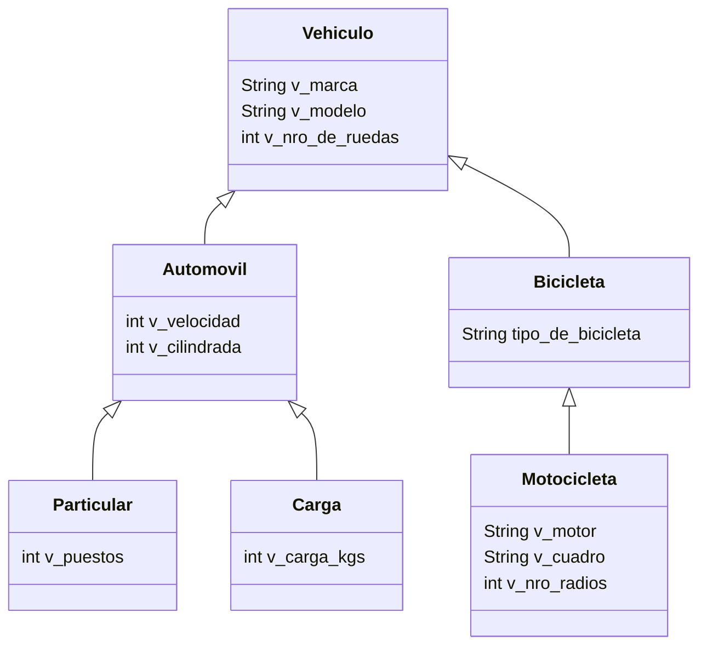

# Evaluación Módulo 4: Uso y aplicación de POO
## MVP Peajes FS: Un prototipo pedagógico de gestión de peajes de vehículos

# Module 4 Assessment: Use and Application of OOP
## MVP Tolls FS: A pedagogical prototype vehicle toll system

## Introducción
Este proyecto, **MVP Peajes FS**, es una aplicación basada en Python diseñada para gestionar datos de vehículos y tarifas asociadas. Proporciona una interfaz fácil de usar desarrollada usando el Framework STREAMLIT que sirve para:
* **Mostrar la relación entre instancias y clases:** Compara clases e instancias de clases, y determina si un objeto es instancia o no de otra clase. 
* **Ingreso de nuevos vehículos:** Añade nuevos vehículos a la base de datos.
* **Gestión de datos:** Modificar, eliminar y buscar registros de vehículos usando filtros avanzados.
* **Cálculo de tarifas:** Usando como clave el tipo de vehículo, utiliza un polinomio de variables para calcular una tarifa y registrar la recaudación.
* **Generación de informes:** Exportar datos en varios formatos (CSV, PDF, Excel).
  
## Introduction
This project, **MVP Peajes FS**, is a Python-based application designed to manage vehicle data and associated fees. It provides a user-friendly interface developed using STREAMLIT Framwework that serves to:
* **Show the relationship between instances and classes:** Compares classes and instances of classes, and determines whether or not an object is an instance of another class.
* **New Vehicles Addition:** Adds new vehicles to the database.
* **Data management:** Modifying, deleting, and searching for vehicle records using advanced filters.
* **Fee calculation:** Using the vehicle type as a key, it uses a polynomial of variables to calculate a fee and record the collection.
* **Report generation:** Exporting data in various formats (CSV, PDF, Excel).

## Características 
* **Interfaz de usuario intuitiva:** Interfaz optimizada para una navegación sencilla, que ofrece menús desplegables, elección de opciones múltiples, etc.
* **Gestión integral de datos:** Los usuarios podrán crear, leer, actualizar y eliminar registros de vehículos.
* **Informes personalizables:** Posibilidad de generar informes personalizados basados ​​en criterios específicos.
* **Gestión robusta de errores:** Proporciona mensajes de error informativos.
* **Escalable:** Diseñado para gestionar una cantidad creciente de vehículos.

## Features
* **Intuitive user interface:** Interface optimized for easy navigation, offering drop-down menus, multiple choice options, etc.
* **Comprehensive data management:** Users could create, read, update, and delete vehicle records.
* **Customizable reports:** Posibility to generate personalized reports based on specific criteria.
* **Robust error handling:** Provides informative error messages.
* **Scalable:** Designed to handle a growing number of vehicles.

## Primeros pasos
1. **Prerequisitos:**
    * Python (version 3.10 o superior)
    * Librerías requeridas:
        -sqlite3     ==> BBDD
        -pandas      ==> librería para el manejo de datos
        -streamlit   ==> librería que permite construir la interfaz 
        -random      ==> generación de cadenas aleatorias
        -string      ==> manejo de cadenas
        -datetime    ==> manejo de fechas
        -BytesIO     ==> para generar el archivo binario y exportar PDF
        -ExcelWriter ==> para exportar EXCEL
        -FPDF        ==> para generar PDF
        -datetime    ==> retornar una fecha, manipulación y conversión de fechas

## Getting Started
1. **Prerequisites:**
    * Python (version 3.10 or above)
    * Required libraries:
        -sqlite3 ==> DB
        -pandas ==> library for data management
        -streamlit ==> library that allows building the interface
        -random ==> generation of random strings
        -string ==> string management
        -datetime ==> date management
        -BytesIO ==> to generate the binary file and export PDF
        -ExcelWriter ==> to export EXCEL
        -FPDF ==> to generate PDF
        -datetime ==> return a date, date manipulation and conversion

2. **Instalacion:**
   ```bash
   pip install -r requirements.txt
 
2. **Installation:**
   ```bash
   pip install -r requirements.txt

3. **Ejecutar la app:**
   ```bash
   streamlit run peajes_fs.py
 
3. **Run the app:**
   ```bash
   streamlit run peajes_fs.py
   

## Historial de cambios
* **Version 0.8.3 (22/09/2024):**
  * Se completaron las secciones de ayuda y de inicio.
* **Version 0.8.2 (26/08/2024):**
  * Improved PDF and Excel export capabilities.
* **Version 0.8.1 (20/08/2024):**
  * Improved the functionality of multifilter drill-down.
  * ...


## Changelog
* **Version 0.8.3 (22/09/2024):**
  * Completed help and home sections.
* **Version 0.8.2 (26/08/2024):**
  * Improved PDF and Excel export capabilities.
* **Version 0.8.1 (20/08/2024):**
  * Improved the functionality of multifilter drill-down.
  * ...


## Diagrama de Clases


## Otra alternativa

@startuml
class Vehiculo {
  -v_marca: String
  -v_modelo: String
  -v_nro_de_ruedas: int
}

class Automovil {
  -v_velocidad: int
  -v_cilindrada: int
}

class Particular {
  -v_puestos: int
}

class Carga {
  -v_carga_kgs: int
}

class Bicicleta {
  -tipo_de_bicicleta: String
}

class Motocicleta {
  -v_motor: String
  -v_cuadro: String
  -v_nro_radios: int
}

Vehiculo <|-- Automovil
Vehiculo <|-- Bicicleta
Automovil <|-- Particular
Automovil <|-- Carga
Bicicleta <|-- Motocicleta
@enduml

## Alternativa 3 TXT

Vehiculo
+-----------------------------+
| - v_marca: String            |
| - v_modelo: String           |
| - v_nro_de_ruedas: int       |
+-----------------------------+

Automovil (hereda de Vehiculo)
+-----------------------------+
| - v_velocidad: int           |
| - v_cilindrada: int          |
+-----------------------------+

Particular (hereda de Automovil)
+-----------------------------+
| - v_puestos: int             |
+-----------------------------+

Carga (hereda de Automovil)
+-----------------------------+
| - v_carga_kgs: int           |
+-----------------------------+

Bicicleta (hereda de Vehiculo)
+-----------------------------+
| - tipo_de_bicicleta: String  |
+-----------------------------+

Motocicleta (hereda de Bicicleta)
+-----------------------------+
| - v_motor: String            |
| - v_cuadro: String           |
| - v_nro_radios: int          |
+-----------------------------+

